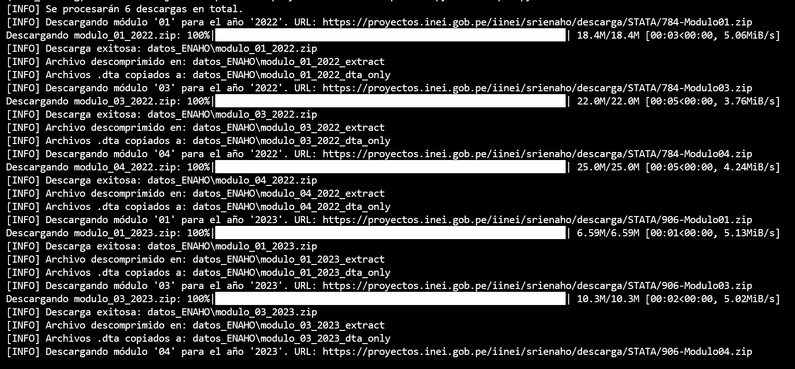
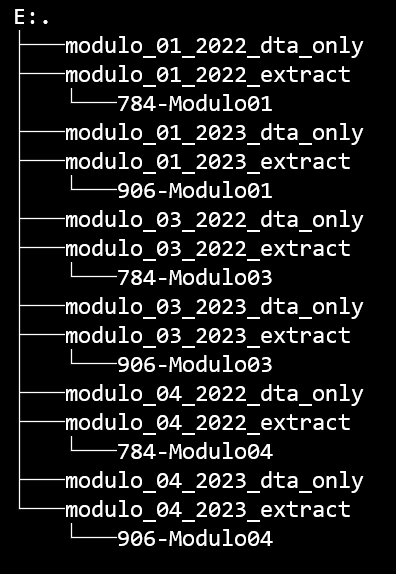

# ENAHODATA
Esta libreria consta de un comando para extraer datos de la Encuesta Nacional de Hogares (ENAHO) del Instituto Nacional de Estadística e Informática (INEI) de Perú que se realiza cada año desde el 2004. Esta encuesta esta organizado por modulos.

<a href="https://proyectos.inei.gob.pe/iinei/srienaho/Descarga/FichaTecnica/498-Ficha.pdf" target="_blank">Ficha técnica</a>

### Modulos de la Encuesta Nacional de Hogares (ENAHO)

Los modulos son los siguientes:

Nro|Código Módulo|Modulo|Preguntas
:-------|:-------|:---------|:------
1|`01`|Características de la Vivienda y del Hogar|<a href="https://proyectos.inei.gob.pe/microdatos/Detalle_Encuesta.asp?CU=19558&CodEncuesta=906&CodModulo=01&NombreEncuesta=Condiciones+de+Vida+y+Pobreza+-+ENAHO&NombreModulo=Características+de+la+Vivienda+y+del+Hogar" target="_blank">`Preguntas`</a>
2|`02`|Características de los Miembros del Hogar|<a href="https://proyectos.inei.gob.pe/microdatos/Detalle_Encuesta.asp?CU=19558&CodEncuesta=906&CodModulo=02&NombreEncuesta=Condiciones+de+Vida+y+Pobreza+-+ENAHO&NombreModulo=Características+de+los+Miembros+del+Hogar" target="_blank">`Preguntas`</a>
3|`03`|Educación|<a href="https://proyectos.inei.gob.pe/microdatos/Detalle_Encuesta.asp?CU=19558&CodEncuesta=906&CodModulo=03&NombreEncuesta=Condiciones+de+Vida+y+Pobreza+-+ENAHO&NombreModulo=Educación" target="_blank">`Preguntas`</a>
4|`04`|Salud|<a href="https://proyectos.inei.gob.pe/microdatos/Detalle_Encuesta.asp?CU=19558&CodEncuesta=906&CodModulo=04&NombreEncuesta=Condiciones+de+Vida+y+Pobreza+-+ENAHO&NombreModulo=Salud" target="_blank">`Preguntas`</a>
5|`05`|Empleo e Ingresos|<a href="https://proyectos.inei.gob.pe/microdatos/Detalle_Encuesta.asp?CU=19558&CodEncuesta=906&CodModulo=05&NombreEncuesta=Condiciones+de+Vida+y+Pobreza+-+ENAHO&NombreModulo=Empleo+e+Ingresos" target="_blank">`Preguntas`</a>
6|`07`|	Gastos en Alimentos y Bebidas (Módulo 601)|<a href="https://proyectos.inei.gob.pe/microdatos/Detalle_Encuesta.asp?CU=19558&CodEncuesta=906&CodModulo=07&NombreEncuesta=Condiciones+de+Vida+y+Pobreza+-+ENAHO&NombreModulo=Gastos+en+Alimentos+y+Bebidas+(Módulo+601)" target="_blank">`Preguntas`</a>
7|`08`|Instituciones Beneficas|<a href="https://proyectos.inei.gob.pe/microdatos/Detalle_Encuesta.asp?CU=19558&CodEncuesta=906&CodModulo=08&NombreEncuesta=Condiciones+de+Vida+y+Pobreza+-+ENAHO&NombreModulo=Instituciones+Beneficas" target="_blank">`Preguntas`</a>
8|`09`|Mantenimiento de la Vivienda|<a href="https://proyectos.inei.gob.pe/microdatos/Detalle_Encuesta.asp?CU=19558&CodEncuesta=906&CodModulo=09&NombreEncuesta=Condiciones+de+Vida+y+Pobreza+-+ENAHO&NombreModulo=Mantenimiento+de+la+Vivienda" target="_blank">`Preguntas`</a>
9|`10`|Transportes y Comunicaciones|<a href="https://proyectos.inei.gob.pe/microdatos/Detalle_Encuesta.asp?CU=19558&CodEncuesta=906&CodModulo=10&NombreEncuesta=Condiciones+de+Vida+y+Pobreza+-+ENAHO&NombreModulo=Transportes+y+Comunicaciones" target="_blank">`Preguntas`</a>
10|`11`|Servicios a la Vivienda|<a href="https://proyectos.inei.gob.pe/microdatos/Detalle_Encuesta.asp?CU=19558&CodEncuesta=906&CodModulo=11&NombreEncuesta=Condiciones+de+Vida+y+Pobreza+-+ENAHO&NombreModulo=Servicios+a+la+Vivienda" target="_blank">`Preguntas`</a>
11|`12`|Esparcimiento , Diversion y Servicios de Cultura|<a href="https://proyectos.inei.gob.pe/microdatos/Detalle_Encuesta.asp?CU=19558&CodEncuesta=906&CodModulo=12&NombreEncuesta=Condiciones+de+Vida+y+Pobreza+-+ENAHO&NombreModulo=Esparcimiento+,+Diversion+y+Servicios+de+Cultura" target="_blank">`Preguntas`</a>
12|`13`|Vestido y Calzado|<a href="https://proyectos.inei.gob.pe/microdatos/Detalle_Encuesta.asp?CU=19558&CodEncuesta=906&CodModulo=13&NombreEncuesta=Condiciones+de+Vida+y+Pobreza+-+ENAHO&NombreModulo=Vestido+y+Calzado" target="_blank">`Preguntas`</a>
13|`15`|Gastos de Transferencias|<a href="https://proyectos.inei.gob.pe/microdatos/Detalle_Encuesta.asp?CU=19558&CodEncuesta=906&CodModulo=15&NombreEncuesta=Condiciones+de+Vida+y+Pobreza+-+ENAHO&NombreModulo=Gastos+de+Transferencias" target="_blank">`Preguntas`</a>
14|`16`|Muebles y Enseres|<a href="https://proyectos.inei.gob.pe/microdatos/Detalle_Encuesta.asp?CU=19558&CodEncuesta=906&CodModulo=16&NombreEncuesta=Condiciones+de+Vida+y+Pobreza+-+ENAHO&NombreModulo=Muebles+y+Enseres" target="_blank">`Preguntas`</a>
15|`17`|Otros Bienes y Servicios|<a href="https://proyectos.inei.gob.pe/microdatos/Detalle_Encuesta.asp?CU=19558&CodEncuesta=906&CodModulo=17&NombreEncuesta=Condiciones+de+Vida+y+Pobreza+-+ENAHO&NombreModulo=Otros+Bienes+y+Servicios" target="_blank">`Preguntas`</a>
16|`18`|Equipamiento del Hogar|<a href="https://proyectos.inei.gob.pe/microdatos/Detalle_Encuesta.asp?CU=19558&CodEncuesta=906&CodModulo=18&NombreEncuesta=Condiciones+de+Vida+y+Pobreza+-+ENAHO&NombreModulo=Equipamiento+del+Hogar" target="_blank">`Preguntas`</a>
17|`22`|Producción Agrícola|<a href="https://proyectos.inei.gob.pe/microdatos/Detalle_Encuesta.asp?CU=19558&CodEncuesta=906&CodModulo=22&NombreEncuesta=Condiciones+de+Vida+y+Pobreza+-+ENAHO&NombreModulo=Producción+Agrícola" target="_blank">`Preguntas`</a>
18|`23`|Subproductos Agricolas|<a href="https://proyectos.inei.gob.pe/microdatos/Detalle_Encuesta.asp?CU=19558&CodEncuesta=906&CodModulo=23&NombreEncuesta=Condiciones+de+Vida+y+Pobreza+-+ENAHO&NombreModulo=Subproductos+Agricolas" target="_blank">`Preguntas`</a>
19|`24`|Producción Forestal|<a href="https://proyectos.inei.gob.pe/microdatos/Detalle_Encuesta.asp?CU=19558&CodEncuesta=906&CodModulo=24&NombreEncuesta=Condiciones+de+Vida+y+Pobreza+-+ENAHO&NombreModulo=Producción+Forestal" target="_blank">`Preguntas`</a>
20|`25`|Gastos en Actividades Agricolas y/o Forestales|<a href="https://proyectos.inei.gob.pe/microdatos/Detalle_Encuesta.asp?CU=19558&CodEncuesta=906&CodModulo=25&NombreEncuesta=Condiciones+de+Vida+y+Pobreza+-+ENAHO&NombreModulo=Gastos+en+Actividades+Agricolas+y/o+Forestales" target="_blank">`Preguntas`</a>
21|`26`|Producción Pecuaria|<a href="https://proyectos.inei.gob.pe/microdatos/Detalle_Encuesta.asp?CU=19558&CodEncuesta=906&CodModulo=26&NombreEncuesta=Condiciones+de+Vida+y+Pobreza+-+ENAHO&NombreModulo=Producción+Pecuaria" target="_blank">`Preguntas`</a>
22|`27`|Subproductos Pecuarios|<a href="https://proyectos.inei.gob.pe/microdatos/Detalle_Encuesta.asp?CU=19558&CodEncuesta=906&CodModulo=27&NombreEncuesta=Condiciones+de+Vida+y+Pobreza+-+ENAHO&NombreModulo=Subproductos+Pecuarios" target="_blank">`Preguntas`</a>
23|`28`|Gastos en Actividades Pecuarias|<a href="https://proyectos.inei.gob.pe/microdatos/Detalle_Encuesta.asp?CU=19558&CodEncuesta=906&CodModulo=28&NombreEncuesta=Condiciones+de+Vida+y+Pobreza+-+ENAHO&NombreModulo=Gastos+en+Actividades+Pecuarias" target="_blank">`Preguntas`</a>
24|`34`|Sumarias ( Variables Calculadas )|<a href="https://proyectos.inei.gob.pe/microdatos/Detalle_Encuesta.asp?CU=19558&CodEncuesta=906&CodModulo=34&NombreEncuesta=Condiciones+de+Vida+y+Pobreza+-+ENAHO&NombreModulo=Sumarias+(+Variables+Calculadas+)" target="_blank">`Preguntas`</a>
25|`37`|Programas Sociales (Miembros del Hogar)|<a href="https://proyectos.inei.gob.pe/microdatos/Detalle_Encuesta.asp?CU=19558&CodEncuesta=906&CodModulo=37&NombreEncuesta=Condiciones+de+Vida+y+Pobreza+-+ENAHO&NombreModulo=Programas+Sociales++(Miembros+del+Hogar)" target="_blank">`Preguntas`</a>
26|`77`|Ingresos del Trabajador Independiente|<a href="https://proyectos.inei.gob.pe/microdatos/Detalle_Encuesta.asp?CU=19558&CodEncuesta=906&CodModulo=77&NombreEncuesta=Condiciones+de+Vida+y+Pobreza+-+ENAHO&NombreModulo=Ingresos+del+Trabajador+Independiente" target="_blank">`Preguntas`</a>
27|`78`|Bienes y Servicios de Cuidados Personales|<a href="https://proyectos.inei.gob.pe/microdatos/Detalle_Encuesta.asp?CU=19558&CodEncuesta=906&CodModulo=78&NombreEncuesta=Condiciones+de+Vida+y+Pobreza+-+ENAHO&NombreModulo=Bienes+y+Servicios+de+Cuidados+Personales" target="_blank">`Preguntas`</a>
28|`84`|Participación Ciudadana|<a href="https://proyectos.inei.gob.pe/microdatos/Detalle_Encuesta.asp?CU=19558&CodEncuesta=906&CodModulo=84&NombreEncuesta=Condiciones+de+Vida+y+Pobreza+-+ENAHO&NombreModulo=Participación+Ciudadana" target="_blank">`Preguntas`</a>
29|`85`|Gobernabilidad, Democracia y Transparencia|<a href="https://proyectos.inei.gob.pe/microdatos/Detalle_Encuesta.asp?CU=19558&CodEncuesta=906&CodModulo=85&NombreEncuesta=Condiciones+de+Vida+y+Pobreza+-+ENAHO&NombreModulo=Gobernabilidad,+Democracia+y+Transparencia" target="_blank">`Preguntas`</a>
30|`1825`|Beneficiarios de Instituciones sin fines de lucro: Olla comun|<a href="https://proyectos.inei.gob.pe/microdatos/Detalle_Encuesta.asp?CU=19558&CodEncuesta=906&CodModulo=1825&NombreEncuesta=Condiciones+de+Vida+y+Pobreza+-+ENAHO&NombreModulo=Beneficiarios+de+Instituciones+sin+fines+de+lucro:+Olla+Común" target="_blank">`Preguntas`</a>

## I. Instalacion

#### Requerimientos
Para el correcto funcionamiento del paquete y sus respectivos modulos, es necesario tener instalado los siguientes paquetes adicionales:

- requests
- tqdm

#### Iniciamos la instalacion
```python
pip install enahodata
```

## II. Descripción de la libreria 

#### 1.- Importamos la libreria

```python
from enahodata import enahodata2 
import os
```

- En esta etapa importamos las librerias que se usaran, **enahodata** para extraer el comando **enahodata2**.
- También importamos **os** para manejar las carpetas.

#### 2.- Definimos el directorio de trabajo
```python
os.chdir("/path/to/your/directory")
```
- Usamos este código para definir el directorio de trabajo donde se trabajará.

#### 3.- Definimos los paramétros del comando **_enahodata2_**
El comando es enahodata2, y tiene los siguientes parametros:
```python
enahodata2(
    modulos: list[str]=["", "", "", ...],
    anios: list[str]=["", "", "", ...],
    descomprimir: bool = False,
    only_dta: bool = False
    overwrite: bool = False,
    output_dir: str = "NOMBRE_CARPETA",   
)
```
- **modulos:** en este parámetro ponemos la lista de modulos que se quiere descargar. Se puede extraer el codigo de la columna _Código Módulo_.
```python
enahodata2(
    modulos = ["01", "02", "03",...],
    ... 
)
```

- **anios:** en este parámetro se pone la lista de años.
```python
enahodata2(
    ...
    anios = ["2020", "2021", "2022",...]
    ...
)
```
- **descomprimir:** con esta opción se selecciona _True_ o _False_ para que se descomprima o no, respectivamente.
```python
enahodata2(
    ...
    descomprimir:bool = ...,
    ...
)
```
- **only_data:** con este parametro del comando seleccionamos si se enfocara solo en los archivos _.dta_ o no. Tiene dos valores _True_ o _False_.
```python
enahodata2(
    ...
    only_dta: bool = ...,
    ...
)
```
- **overwrite:** con esta opción se indica si se reemplaza los archivos ya existentes o no. Tiene dos valores _True_ o _False_.
```python
enahodata2(
    ...
    overwrite: bool = ...,
    ...
)
```
- **output_dir:** con este parámetro se indica el nombre que tendra la carpeta donde se almacenaran los archivos de los modulos descargados de la ENAHO. 
```python
enahodata2(
    ...
    output_dir: str = "NOMBRE_CARPETA",   
)
```


#### 4.- Plantilla completa

```python
from enahodata import enahodata2 
import os

os.chdir("/path/to/your/directory")

enahodata2(
    modulos = ["01", "02", "03",...],,
    anios = list[str],
    descomprimir = ...,
    only_dta = ...,
    overwrite = ...,
    output_dir = "NOMBRE_CARPETA",   
)

```

## III. Ejemplo práctico

Se necesita descargar de los años 2022 y 2023, los siguientes módulos de la Encuesta Nacional de Hogares de Perú:
- Características de la Vivienda y del Hogar
- Educación 
- Salud

Entonces, con la información anterior revisamos el codigo de cada modulo. En este caso los codigos son los siguientes:
- `01` : Características de la vivienda y del hogar
- `03` : Educación
- `04` : Salud

Luego, realizamos lo siguiente:
```python
pip install enahodata
```
En otro archivo `ejemplo.py`, por ejemplo escribimos el siguiente código:
```python
from enahodata import enahodata2
import os

os.chdir("C:\Users\Usuario\Desktop\ejemplo")

enahodata2(
  modulos=["01","03","04"],
  anios=["2022", "2023"],
  descomprimir=True,
  only_dta=True,
  overwrite=True, 
  output_dir="datos_ENAHO"
)

```
Ejecutamos el codigo:
```python
python ejemplo.py
```


Y se creara la siguiente estructura de carpetas, como resultado:



Donde:
- **/modulo_01_2022_dta_only** 
- **/modulo_01_2023_dta_only** 
- **/modulo_03_2022_dta_only** 
- **/modulo_03_2023_dta_only** 
- **/modulo_04_2022_dta_only** 
- **/modulo_04_2023_dta_only** 
>Son las carpetas donde se encuentran los dataset en formato `.dta`

- **/modulo_01_2022_extract** 
- **/modulo_01_2023_extract** 
- **/modulo_03_2022_extract** 
- **/modulo_03_2023_extract** 
- **/modulo_04_2022_extract** 
- **/modulo_04_2023_extract** 

>En estas carpetas se encuentran, la información descomprimida de la ENAHO, con toda la información que viene desde el portal de microdatos del INEI.

## Licencia

Este repositorio esta autorizado bajo la licencia MIT. Ver <a href="./LICENSE">LICENCIA</a> para mas detalles.